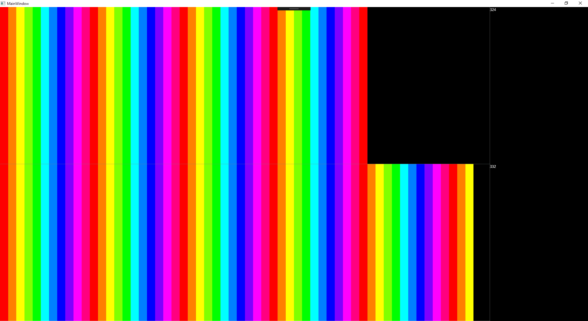

# DrawingJpeg

WritableBitmapとBitmapFrameの速度比較を行うサンプル



## BitmapFrame

BitmapFrameはImageコンポーネントにそのままBinding

```
<Image Source="{Binding BitmapFrame}" Grid.Column="0" Grid.Row="1" Stretch="Fill" Grid.ColumnSpan="1"/>
```

```
Application.Current.Dispatcher.Invoke(() =>
{
    BitmapFrame = frame;
}, System.Windows.Threading.DispatcherPriority.Background);
```

## WritableBitmap

WritableBitmapを作成し、更新時は指定した範囲を書き換え

```
<Image Source="{Binding BitmapFrame}" Grid.Column="0" Grid.Row="1" Stretch="Fill" Grid.ColumnSpan="1"/>
```

```
writableBitmap = new WriteableBitmap(3841, 2162, 96, 96, System.Windows.Media.PixelFormats.Bgr32, null);
Application.Current.Dispatcher.Invoke(() =>
{
    writableBitmap.Lock();
    frame.CopyPixels(new System.Windows.Int32Rect(0, 0, 3841, 2162), writableBitmap.BackBuffer, (int)writableBitmap.BackBufferStride * (int)writableBitmap.Height, (int)writableBitmap.BackBufferStride);
    writableBitmap.AddDirtyRect(new System.Windows.Int32Rect(0, 0, 3841, 2162));
    writableBitmap.Unlock();
}, System.Windows.Threading.DispatcherPriority.Background);
```
